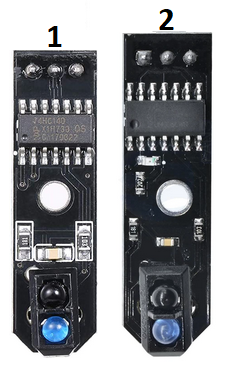
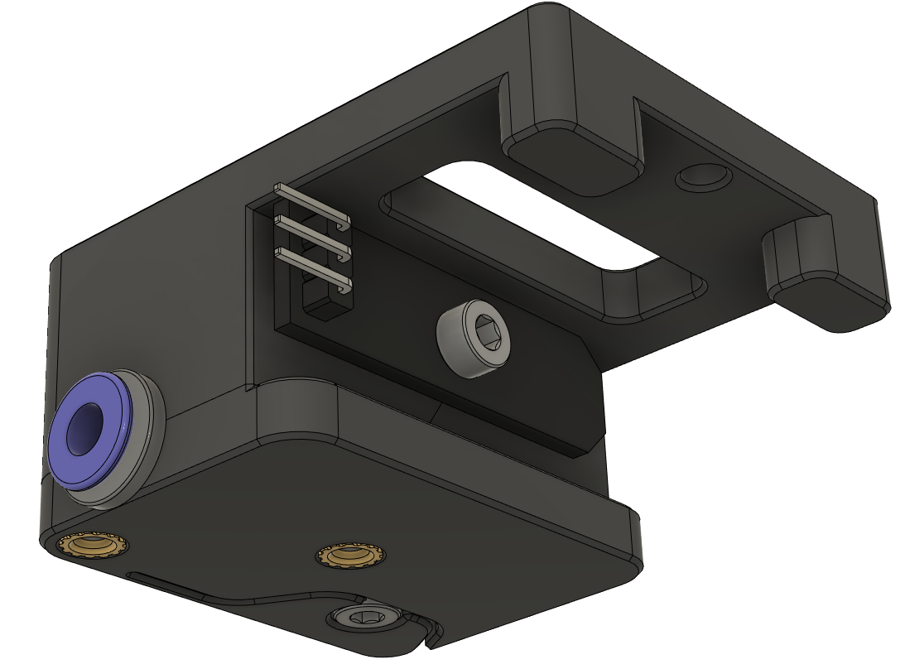
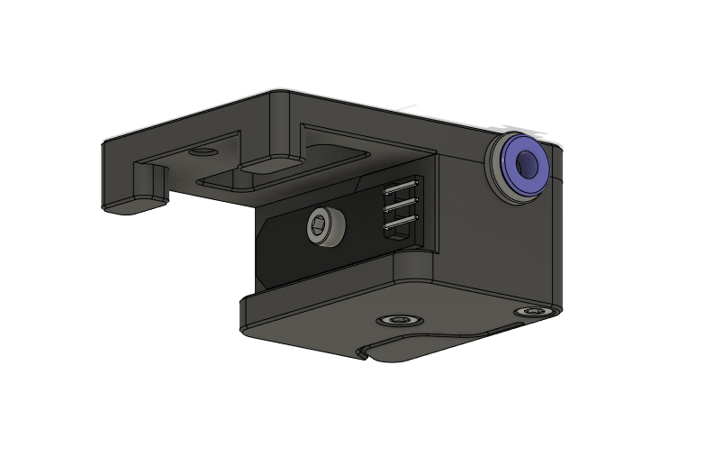
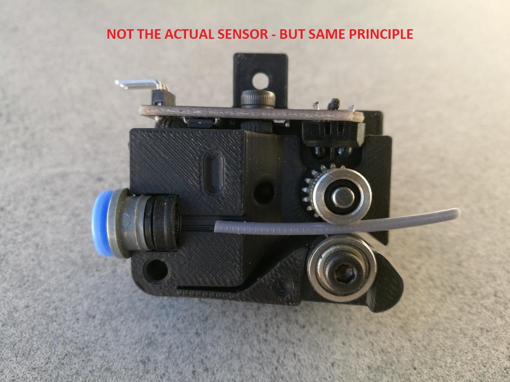

# Voron 2.4 Filament motion sensor with TCRT5000
Made by Tircown#8715

Can detect:
- filament runout,
- partial or complete clog of the hotend,
- knots blocking into the spool.

### Bill Of Materials
* 1 TCRT5000 - long black PCB "improved" version (n°2 in the picture)
* 1 Bearing 623ZZ
* 1 Bondtech dual-gear - only the timing gear with the needles bearings and the shaft
* 3 M3x20
* 1 M3x8
* 2 M3 threaded inserts
* 1 ECAS (optional)

*n°1 is bad - n°2 is good*

### Instruction
1. Install the two M3 threaded inserts on the right part,
2. Install the bearing with a M3x20 by self-tapping in the left part,
3. Insert the dual-gear shaft into the corresponding hole on the left side,
4. Place the needles bearings and the dual-gear on the shaft,
5. Place the optionnal ECAS,
6. Assemble the two halves with two M3x20,
7. Install the TCRT5000 module with a M3x20 by self-tapping.

### Configuration
See the [filament_motion_sensor] section in [Config_Reference](https://github.com/KevinOConnor/klipper/blob/master/docs/Config_Reference.md#filament_motion_sensor).\
A good starting value is `detection_length: 2.0`

### Pictures
##### Normal

##### Inverted

##### Assembly

