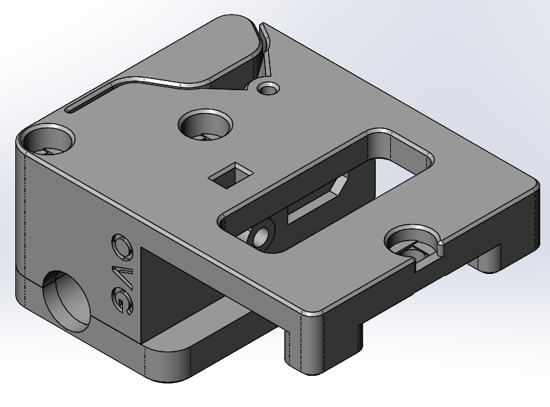
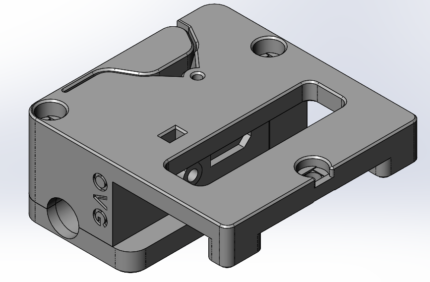
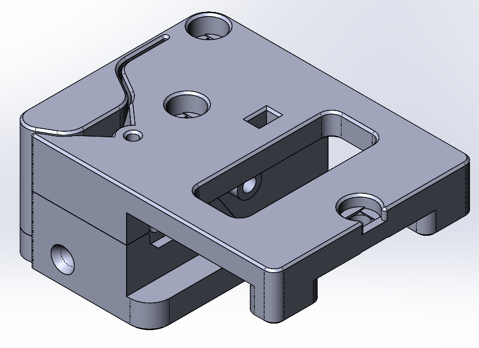
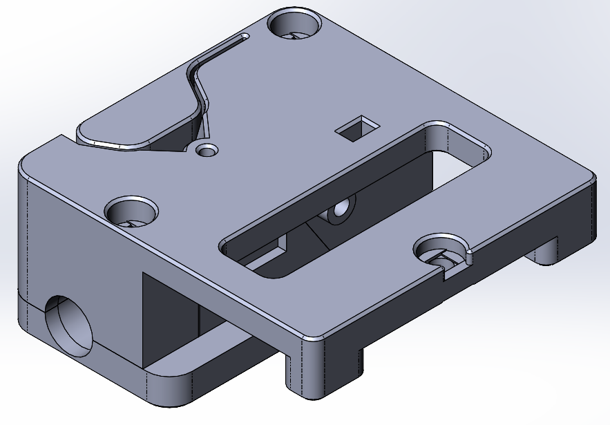
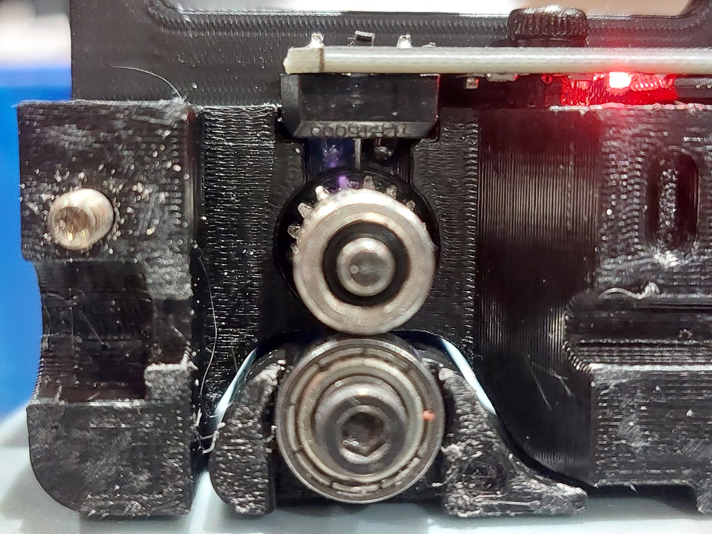
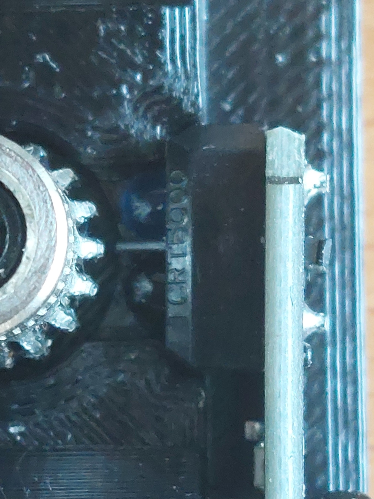

# Tircown's Filament_motion_sensor tweak

Original design is here: <https://github.com/Tircown/VoronFrenchUsers/tree/main/Mod/Filament_motion_sensor>
And here: <https://github.com/elpopo-eng/VoronFrenchUsers/tree/main/Mod/Filament_motion_sensor>
Please read instructions there.

## Configurations

### Explanations

- M1: mounting side 1
- M2: mounting side 2
- 1C: 1 tube fitting
- 2C: 2 tube fitting

### Highlighted configurations

- M1-1C configuration is the closest to the original.
- M2-2C is the one I use.

### Configuration list

M1-1C

M1-2C

M2-1C

M2-2C

## Why?

I wanted:

- Suppot of PTFE fitting on both sides. Then I designed for 2 sides (2C configuration).
- Mounting on the other side.

I also made adjustements for:

- Better sensor enclosing. The first original one I tested didn't work due to too much light passing between the emitter LED and the receptor.
- Overhangs
- ...

## How it works

A sprocket rotate, driven by the advancing filament. Tooth of the sprocket cut light between a LED emittor and a recptor. The cutting frequency tells the filament sensor if the filament move.

Encasing as to be tight too avoid too much light passing. Else there won't be any signal edge.

