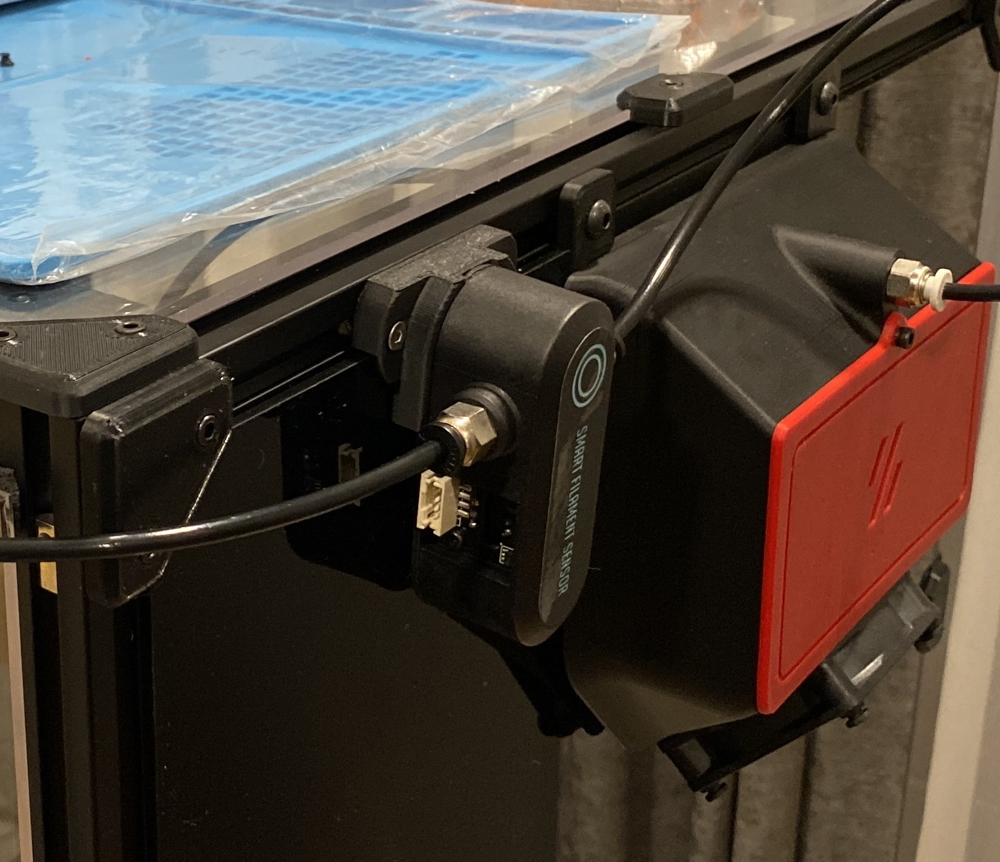

# Voron 2.4 Smart Fileament Sensor Mount
Made by Tircown - requested and tried out by Univ

### Bill Of Materials
* BTT Smart Filament Sensor
* 4 M3x14

### Instruction
Remove the two first screws of the sensor and use M3x14 through the mount.

