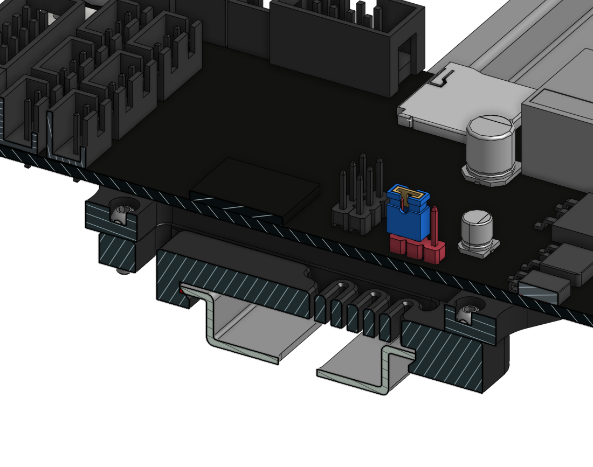
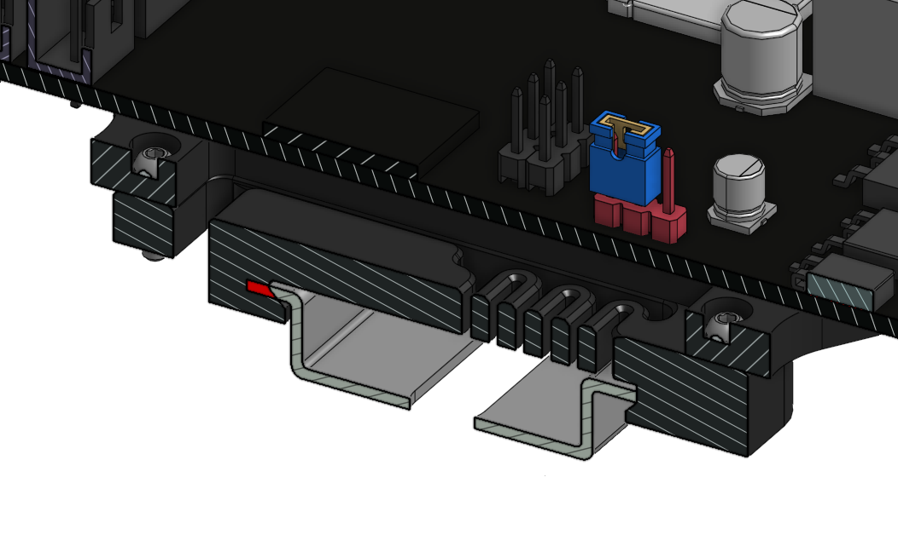
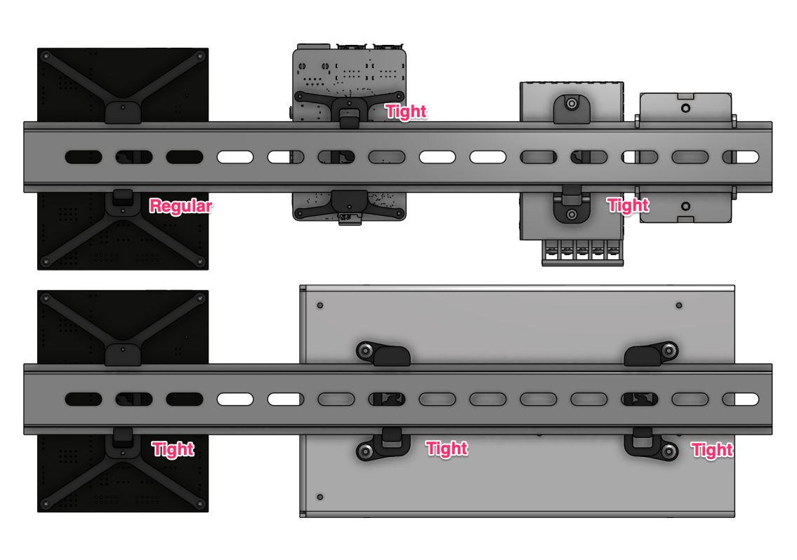

# Tighter Brackets for fixation to DIN rail (Electronics)
made by mike&cows

## Introduction

Depending on the characteristics of the material used to print the brackets, the original design can have a tendency to slide too easily on the DIN rail.
The following part where adjusted to have a tighter grip on the DIN rail by placing the moving clamp 2 mm closer to the other side.

Parts modified (STEP and STL provided)
- LRS PSU Bracket Tight (required a second one mirrored)
- RS-25 PSU Bracket Tight 
- SKR 1.3 Bracket Tight (also used for the Raspberry PI) x 3

## Regular Fit

## Tight Fit

## Overview

